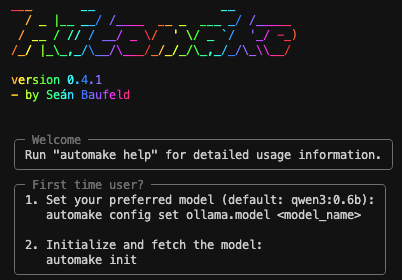

# 🤖 automake: Your AI Command-Line Assistant
*The AI-native shell that turns natural language into actions.*

[](https://pypi.org/project/automake-cli/)
[](CHANGELOG.md)
[](LICENSE)
[](https://github.com/biokraft/auto-make)
[](https://github.com/biokraft/auto-make/actions/workflows/ci.yml)
[](https://codecov.io/gh/biokraft/auto-make)
[](https://badge.fury.io/py/automake-cli)


[](https://www.python.org/downloads/)
[](https://github.com/pre-commit/pre-commit)
[](https://github.com/astral-sh/ruff)
[](https://pytest.org)

---



---

**automake** is a Python-based, agent-first command-line tool that uses a sophisticated multi-agent system, built on the `smolagents` framework, to interpret your natural language commands and execute them. A central **Manager Agent** orchestrates a team of specialists (Terminal, Coding, Web, Makefile, FileSystem) to accomplish complex tasks through intelligent delegation.

Forget remembering complex flags or exact `Makefile` targets. Just tell `automake` what you want to do, and let the AI agents handle the rest.

## ✨ Key Features
- **AI-Native Commands**: Run terminal commands, execute `Makefile` targets, write code, and perform web searches using natural language.
- **Multi-Agent System**: A sophisticated `ManagerAgent` orchestrates a team of specialists (Terminal, Coding, Web, Makefile, FileSystem) to get the job done right.
- **Interactive & Non-Interactive Modes**: Use `automake agent` for complex chat sessions or `automake "task"` for quick one-off commands.
- **Autonomous Task Execution**: Agents can break down complex requests into multiple steps and execute them autonomously.
- **Secure Sandboxing**: Python code execution happens in isolated `uv` environments for maximum security.
- **Local First**: Integrates with local LLMs via [Ollama](https://ollama.ai/) for privacy and offline access.
- **Intelligent Error Handling**: If you make a typo, the agent will analyze the error and suggest a correction.
- **User-Friendly & Configurable**: A clean CLI and a simple `config.toml` file for all your settings.

## ⚙️ How It Works
`automake` puts an AI agent at the heart of your command line, following a modern, agentic workflow powered by the `smolagents` framework:

1.  **Parse Prompt**: The CLI captures your natural language instruction (e.g., `automake "list all python files"`).
2.  **Manager Agent Invocation**: Your prompt is sent directly to the central **Manager Agent**, which acts as the orchestrator.
3.  **Intelligent Reasoning**: The Manager Agent analyzes your request using advanced reasoning capabilities and determines the best approach.
4.  **Smart Delegation**: Based on the analysis, the Manager Agent delegates to the appropriate specialist:
    - **Terminal Agent**: For shell commands and system operations
    - **Coding Agent**: For Python code execution in sandboxed environments
    - **Web Agent**: For internet searches and web-based information
    - **Makefile Agent**: For build system operations and target execution
    - **FileSystem Agent**: For file and directory operations
5.  **Autonomous Execution**: The specialist agent executes the task with full autonomy, potentially breaking complex tasks into multiple steps.
6.  **Real-time Streaming**: All results and agent reasoning are streamed directly to your terminal for full transparency.

This entire workflow can be triggered in two ways:
- **Non-interactive**: `automake "list all python files"` (executes and exits)
- **Interactive**: `automake agent` (starts a persistent chat session)

## 🚀 Getting Started

### Prerequisites
- Python 3.13+
- [uv](https://github.com/astral-sh/uv) (recommended for installation)
- An active [Ollama](https://ollama.ai/) server with a running model (e.g., `ollama run qwen3:0.6b`).

### Installation

There are several ways to install and run `automake`.

#### Recommended: `uv tool install`
For a permanent installation, we recommend using `uv tool install`. This makes the `automake` command available globally in a dedicated environment.

**1. From Git (Bleeding Edge)**
Install the very latest version directly from this repository:
```bash
# Install the latest version from the main branch
uv tool install git+https://github.com/biokraft/auto-make.git

# You can also install a specific tag or branch
uv tool install git+https://github.com/biokraft/auto-make.git@v0.4.8
```

**2. From PyPI (Stable)**
Install the latest stable release from PyPI:
```bash
uv tool install automake-cli
```

#### Temporary Execution: `uvx`
If you prefer not to install the tool, you can run it directly using `uvx` (similar to `npx`). This downloads and runs the package in a temporary environment.
```bash
uvx automake-cli run "your command here"
```

#### Traditional `pip`
You can also use `pip` for a standard installation:
```bash
pip install automake-cli
```

### First-Time Setup
After installation, run the initialization command once to set up Ollama and download the required model:
```bash
automake init
```
This command will:
- Verify that Ollama is installed and running.
- Download the configured LLM model if not already available.
- Ensure everything is ready for natural language command interpretation.

## ✍️ Usage

### Non-Interactive Commands
The primary way to use `automake` is by passing your request directly as a string argument:

```bash
# Run terminal commands through the Terminal Agent
automake "recursively find all files named README.md"
automake "show me the git status and recent commits"

# Execute Makefile targets through the Makefile Agent
automake "run the tests and generate a coverage report"
automake "build the project"

# Code execution through the Coding Agent
automake "create a Python script that calculates fibonacci numbers"
automake "analyze this CSV file and show me statistics"

# File operations through the FileSystem Agent
automake "read the contents of config.toml and explain the settings"
automake "create a new README file with project overview"

# Web searches through the Web Agent
automake "search for the latest Python packaging best practices"
```

### Interactive Agent Session
For complex, multi-step tasks or exploratory work, start an interactive chat session with the Manager Agent:
```bash
automake agent
```

In interactive mode, you can:
- Have natural conversations with the AI
- Execute multiple related tasks in sequence
- Get explanations and clarifications
- Iterate on solutions with agent feedback
- Access all specialist agents through the Manager Agent

Example interactive session:
```
🤖 Manager Agent: How can I help you today?
👤 You: I need to analyze the Python files in this project
🤖 Manager Agent: I'll help you analyze the Python files. Let me start by exploring the project structure...
[Agent executes file system operations and code analysis]
👤 You: Now create a summary report of the findings
🤖 Manager Agent: I'll create a comprehensive report based on my analysis...
```

For detailed usage information and available options, run:
```bash
automake help
```

## 🛠️ Configuration
`automake` features a modern, user-friendly configuration system. On first run, it creates a `config.toml` file in your user configuration directory.

### Setting the AI Model
Configure your preferred Ollama model:
```bash
# Set a specific model
automake config set ollama.model "qwen2.5:7b"

# After changing the model, initialize it
automake init
```

**Important**: After changing the model, you must run `automake init` to download and initialize the new model if it's not already available locally.

### View and Modify Configuration
- **View current config**: `automake config show`
- **Set specific values**: `automake config set <section.key> <value>`
- **Edit manually**: `automake config edit`
- **Reset to defaults**: `automake config reset`

### Common Configuration Examples
```bash
# Set the AI model
automake config set ollama.model "qwen3:8b"

# Set the Ollama server URL
automake config set ollama.base_url "http://localhost:11434"

# Set logging level
automake config set logging.level "DEBUG"

# Set AI interaction threshold
automake config set ai.interactive_threshold 90
```

### Configuration Structure
Run `automake config show` to see the current configuration.
```toml
# Example from automake config show
[ollama]
base_url = "http://localhost:11434"
model = "qwen3:0.6b"

[logging]
level = "INFO"

[ai]
interactive_threshold = 80

[agent]
require_confirmation = true  # Require user confirmation for file operations
```

## 🔒 Security & Safety
AutoMake implements multiple security layers to ensure safe operation:

- **Sandboxed Code Execution**: All Python code runs in isolated `uv` virtual environments
- **User Confirmation**: File operations and system commands can require explicit user approval
- **Local LLM**: Uses local Ollama models by default, keeping your data private
- **Transparent Operations**: All agent actions are logged and displayed in real-time
- **Configurable Safety**: Adjust confirmation requirements based on your trust level

Configure safety settings:
```bash
# Require confirmation for all agent actions (recommended)
automake config set agent.require_confirmation true

# Allow agents to operate without confirmation (use with caution)
automake config set agent.require_confirmation false
```

## 🎬 Demos
Want to see some UI/UX demos?
Just run `uv run make demo-all`
or use automake: `automake "show all demos"`

> **Note:** Running demos with automake may cause animation display issues. For the best demo experience, use the direct `uv run make demo-all` command.

## 🔧 Troubleshooting

### Common Issues

**Agent fails to start:**
- Ensure Ollama is installed and running: `ollama serve`
- Check if your configured model is available: `ollama list`
- Run `automake init` to download the required model

**Agent gives unexpected results:**
- Try a more specific prompt with clear instructions
- Use interactive mode (`automake agent`) for complex tasks
- Check the logs: `automake logs`

**Permission errors:**
- Ensure you have write permissions in the current directory
- Check if `uv` is properly installed and accessible
- Verify file paths in your prompts are correct

**Slow agent responses:**
- Consider using a smaller, faster model (e.g., `qwen3:0.6b`)
- Check your system resources and Ollama performance
- Use `automake config set ollama.model "faster-model"` and run `automake init`

**Agent actions require confirmation:**
- This is a safety feature. Disable with: `automake config set agent.require_confirmation false`
- Or approve each action individually for better security

### Debug Mode
Enable detailed logging for troubleshooting:
```bash
automake config set logging.level "DEBUG"
automake logs  # View detailed logs
```

## 🗺️ Project Roadmap
For a detailed breakdown of the project roadmap, implementation phases, and technical specifications, see [SPECS.md](SPECS.md).

## 📜 Changelog
All notable changes to this project are documented in the [CHANGELOG.md](CHANGELOG.md) file.

## 📄 License
This project is licensed under the Apache 2.0 License. See the [LICENSE](LICENSE) file for details.
